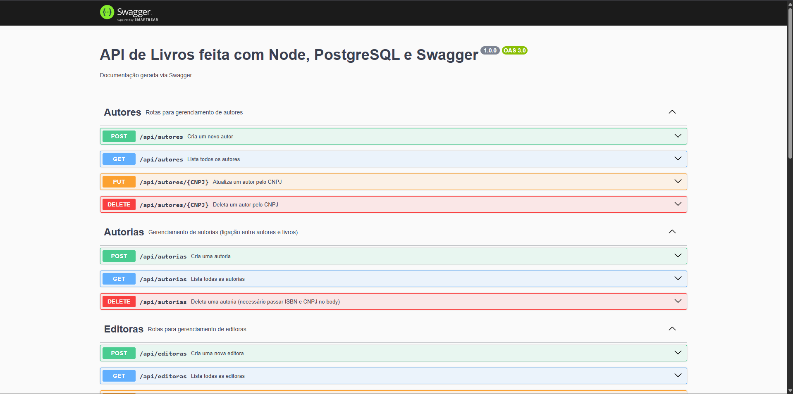

# CRUD API - Node.js

API desenvolvida utilizando **Node.js**, **Express** e documentada com **Swagger**.

## ✅ Aprendizados

Durante o desenvolvimento desta API, foram adquiridos conhecimentos em:

- Estruturação de uma API RESTful com Node.js e Express;
- Integração e documentação com Swagger;
- Manipulação de dados com PostgreSQL;
- Organização de rotas, controllers e serviços;
- Práticas de versionamento e boas práticas de código.

## 📱 Aplicação Consumidora

Esta API foi criada para ser consumida pelo aplicativo **EconoLivros**, desenvolvido em **React**.

